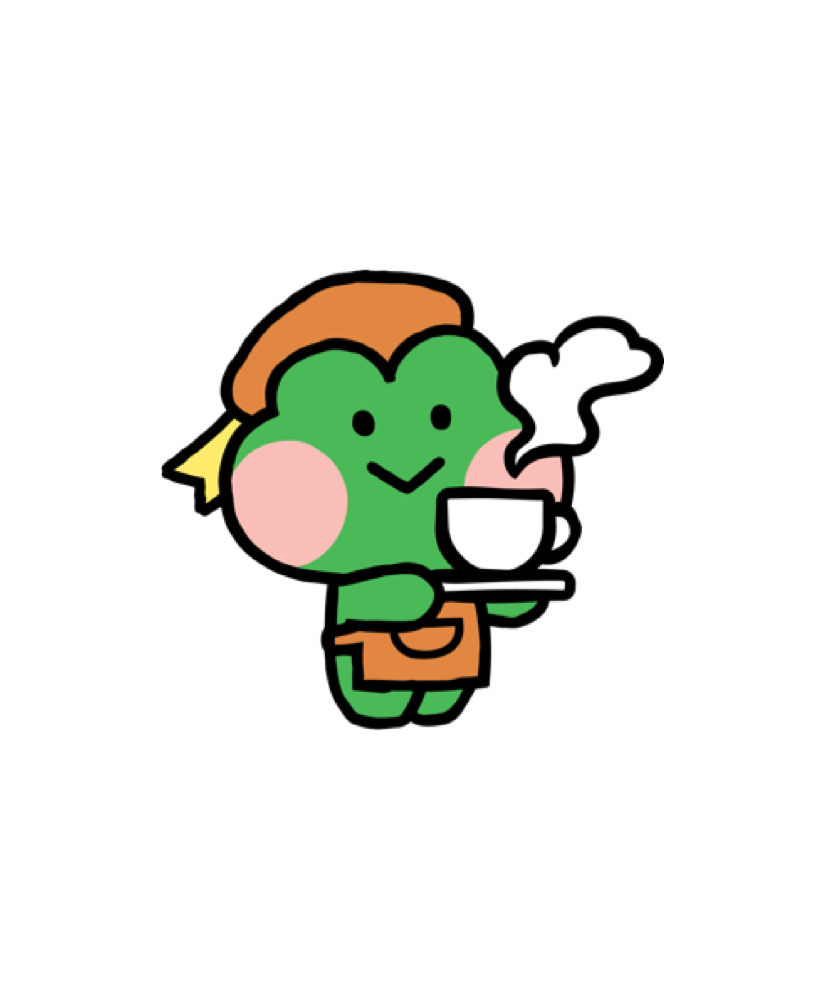

<p align="center">
  
</p>

<h1 align="center">안녕하세요, 오지원입니다 👋</h1>

<p align="center">
  화학공학도 출신 | 품질관리 경력 | 캐나다 바리스타 | AI 개발자 성장 중
</p>

<p align="center">
  
</p>

---

## 🙋‍♀️ About Me

> 화학공학에서 쌓은 **분석적 사고**와 품질관리에서 익힌 **꼼꼼함**, 그리고 캐나다 생활에서 얻은 **도전 정신**을 바탕으로 AI 개발자로 전환 중입니다.

- 🎓 숙명여자대학교 화공생명공학과 졸업 (GPA 3.8/4.5)
- 💼 한국콜마 품질혁신팀에서 OTC 밸리데이션 & 변경관리 경험
- ✈️ 캐나다 워킹홀리데이 — 현지 카페 바리스타로 근무하며 글로벌 경험 축적
- 🤖 현재 **디지털 맞춤 교육**을 통해 AI 개발 역량을 키우는 중

---

## 📚 Education

| 기간 | 학교 | 전공 | 비고 |
|------|------|------|------|
| 2017.03 – 2022.08 | 숙명여자대학교 | 화공생명공학과 | GPA 3.8 / 4.5 |

---

## 💼 Work Experience

### 한국콜마 | 품질혁신팀
**2022.07 – 2023.08**

- OTC(일반의약품) 제품 **밸리데이션** 업무 수행
- 제품 변경 사항에 대한 **변경관리(Change Control)** 담당
- 품질 기준 수립 및 문서 관리

---

### 캐나다 워킹홀리데이 | 현지 카페 바리스타
**2023.10 – 2025.09**

- 영어권 환경에서 **글로벌 커뮤니케이션** 능력 향상
- 다국적 고객 응대 및 팀워크 경험
- 새로운 환경에 대한 **적응력**과 **도전 정신** 함양

---

## 🏅 Certifications

| 자격증 | 등급 | 발급기관 |
|--------|------|----------|
| OPIc | AL (Advanced Low) | ACTFL |
| 컴퓨터활용능력 | 2급 | 대한상공회의소 |

---

## 🚀 현재 진행 중

```
🌱 쉬었음 청년 디지털 맞춤 교육 수강 중
   ├── AI 개발 기초부터 심화까지
   ├── Python / 머신러닝 / 딥러닝
   └── 실전 프로젝트를 통한 포트폴리오 구축
```

---

## 🛠️ Skills & Learning

<p>
  
  
  
  
</p>

**전공 관련**
- 화학공학 기초 지식 (물질 및 에너지 균형, 반응공학)
- 제약/화장품 품질관리 (GMP, 밸리데이션, 변경관리)

**언어**
- 🇰🇷 한국어 (원어민)
- 🇨🇦 영어 (비즈니스 수준, 캐나다 현장 경험)

---

## 📈 GitHub Stats

<p align="center">
  
</p>
<p align="center">
  
  
</p>

---

## 💬 Contact

<p>
  <a href="mailto:stecy73@naver.com">
    
  </a>
  <a href="https://github.com/JIwonOh-omp">
    
  </a>
</p>

---

<p align="center">
  <i>"화학공학의 논리적 사고 + 품질관리의 꼼꼼함 + 도전하는 용기 = AI 개발자 오지원"</i>
</p>

<p align="center">
  
</p>
